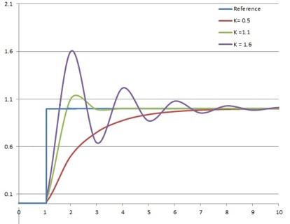
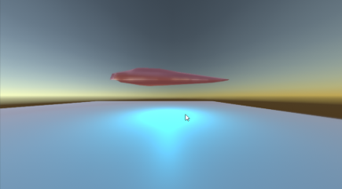
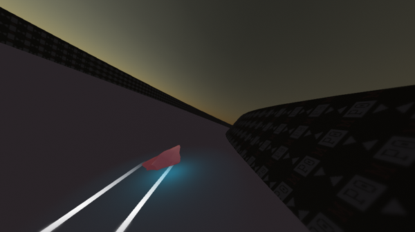
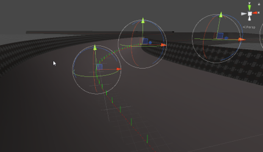

# Dokumentacija - Baza za izradu igre utrkivanja lebdećim autima
## Računalna grafika - 3. laboratorijska vježba
### Mislav Požek

## Alati
Radi olakšane izrade projekta, za izradu baze računalne igre korišten je Unity 2018.3.

## Ciljevi
Glavni cilj ovog projekta bio je izraditi bazične sustave za izradu igre utrkivanja lebdećim autima.
To je uključivalo izradu tri podzadatka:

1. Izrada kontrolera lebdećeg auta
2. Postavljanje sustava kamere koja prati auto
3. Razvijanje alata za laganu izgradnju trkaćih traka

U nastavku dokumentacije opisati ću rezultate ostvarivanja svakog od ciljeva.

## Kontroler lebdećeg auta
U sklopu ovog projekta bilo je potrebno implementirati kontroler lebdećeg auta.
Za simulaciju fizičkih interakcija sa svijetom korišten je ugrađen stroj fizike (physics engine) Unity-a (Unity u pozadini koristi PhysX).

Sam kontroler ponašanja auta napisan je u sklopu projekta.
Kako bi se simuliralo lebdenje auta iznad površine, korišteno je više detekcijskih točaka koje procijenjuju relativnu poziciju, udaljenost i normalu "zemlje" s obzirom na auto.

U slučaju detekcije zemlje, autu simuliramo gravitacijsku silu u smjeru normale površine iznad koje se nalazi. Kako bi auto lebdio potrebno je izračunati i protusilu potrebnu za očuvanje ekvilibrija.

Za određivanje pravilne količine protusile koja u konačnom vremenu teži pozicijonirati auto određenu visinu iznad zemlje, korišten je PID kontroler.

Dodavanjem gasa, autu se dodaje sila u lokalnom smijeru prema naprijed. 

Osim gasa, gravitacije i protu-gravitacije, na auto djeluju i sile otpora zraka. Sile otpora zraka implementirane su nefizikalno radi lakše kontrole parametara i boljeg osjećaja vožnje. Sile otpora zraka djeluju u dvije faze:

- u tranutku kada auto dodaje gas, sile otpora zraka usporavati će svaku komponentu brzine koja ne odgovara prednjem gibanju, time usporavajući proklizavanja

- u trenutku kada auto ne dodaje gas, sile otpora zraka znatno se povećavaju kako bi se auto zaustavio

## Sustav kamere
Za potrebe postavljanja baze igre utrkivanja lebdećim autima, bilo je potrebno postaviti sustav kamere koja prati lebdeći auto.
Za kontrolu kamere korišten je sustav *Cinemachine*. Radi se o dodatku za Unity koji olakšava implementaciju kompleksnih gibanja kamere.

Sustav kamere postavljen je tako da prati poziciju iza auta te fokusira buduću predviđenu poziciju auta. Kamera kasni za svakim gibanjem što daje osjećaj veće brzine.

## Alati za izradu trkaćih traka
Radi što lakše izrade testnih trkaćih traka, ostvarena je implementacija alata za izradu istih.

Alat omogućuje korisniku definiranje krivulje catmul-rom kroz proizvoljan broj kontrolnih točaka. Kontrolne točke dodatno određuju i orijentaciju svog segmenta trake, dok se između točaka orijentacija interpolira.

Uzorkovanjem krivulje generiramo točke modela trake kojemu je moguće dodatno definirati oblik vertikalnog presjeka.